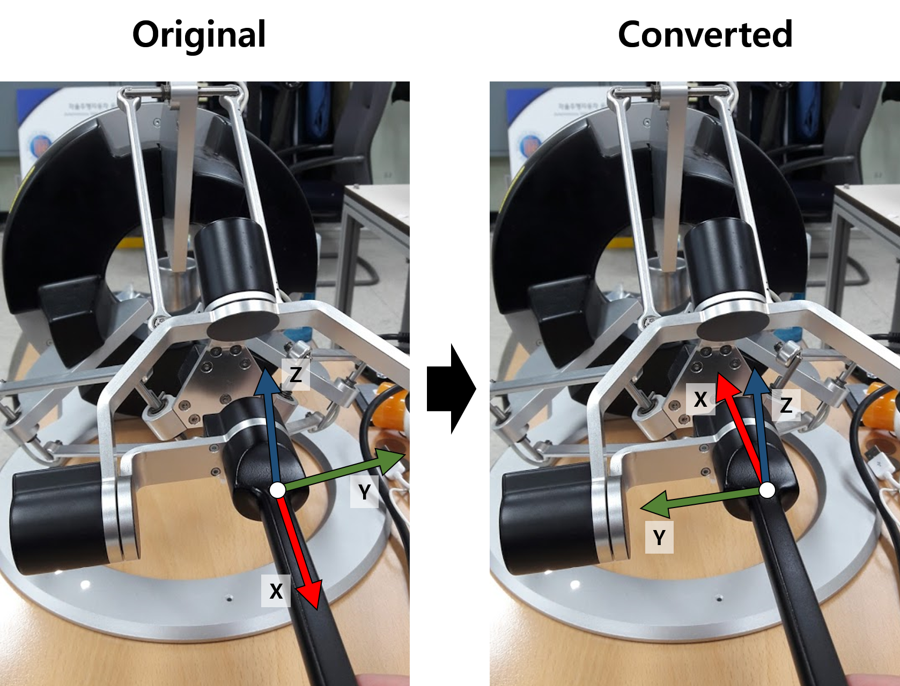

Haptic device packages for master device of teleoperation.

## How to use

 1. Test run for your haptic device

  ```
  $ roslaunch ur_teleop_master test_haptic_device.launch
  ```

## Supported Devices

 * **Omega6(Force-Dimensions)**
 * **~~Phantom~~(TODO)**


## Coordinates System

 Each device's own coordinates system are not maintained  out of the `HapticDevice` instance.
 
 The following images describe re-defined coordinates  systems.
 
### 1. Omega6

  

